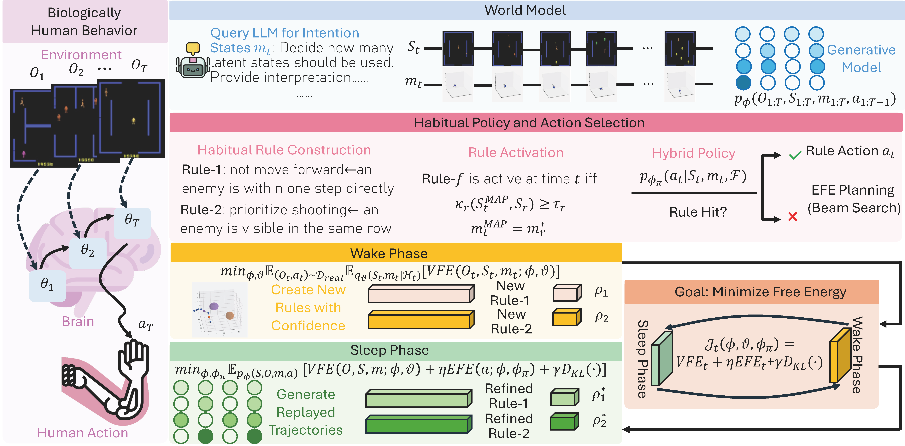

# Learning Human Habits with Rule-Guided Active Inference

Official repository for the paper **"Learning Human Habits with Rule-Guided Active Inference"** (ICLR 2026).

- **Paper:** [OpenReview](https://openreview.net/forum?id=FZXwkBH6s7)
- **Authors:** Zhiren Gong, Chao Yang, Wendi Ren, Shuang Li

### Model framework (Figure 1)

| |
|:--:|
|  |
| *Figure 1: Model framework. Wake–sleep rule learning and active inference.* |

---

## Overview

Humans navigate daily life by combining *deliberate planning* in novel situations and *fast, automatic responses* in familiar ones. This work presents a framework for **learning human habits with rule-guided active inference**, where habits emerge as *symbolic rules* that serve as compact, interpretable shortcuts for action. We design a biologically inspired **wake–sleep algorithm**: in the *wake phase*, the agent harvests candidate rules from real experience; in the *sleep phase*, it performs generative replay to consolidate and prune rules under a unified free-energy objective. The framework supports both instant rule-based action in familiar scenarios and flexible planning via expected free energy in novel cases.

**Main contributions:**
- A biologically inspired extension of active inference for modeling human(-like) habits via rule-guided policies  
- A novel wake–sleep algorithm that jointly learns generative models and symbolic rules  
- Empirical evidence on NBA SportVU, car-following, medical diagnosis (DDXPlus), and Atari–Berzerk, with improved predictive performance and interpretability  

---

## Code

**The code is currently under refinement.** We will release the implementation as soon as it is ready. Please watch this repository or check back later for updates.

---

## Citation

If you find this work useful, please cite:

```bibtex
@inproceedings{zhiren2026learning,
  title     = {Learning Human Habits with Rule-Guided Active Inference},
  author    = {GONG ZHIREN and Chao Yang and Wendi Ren and Shuang Li},
  booktitle = {The Fourteenth International Conference on Learning Representations},
  year      = {2026},
  url       = {https://openreview.net/forum?id=FZXwkBH6s7}
}
```

---

## License

This project is for academic use. Please refer to the paper and the license file in the repository for details once the code is released.
